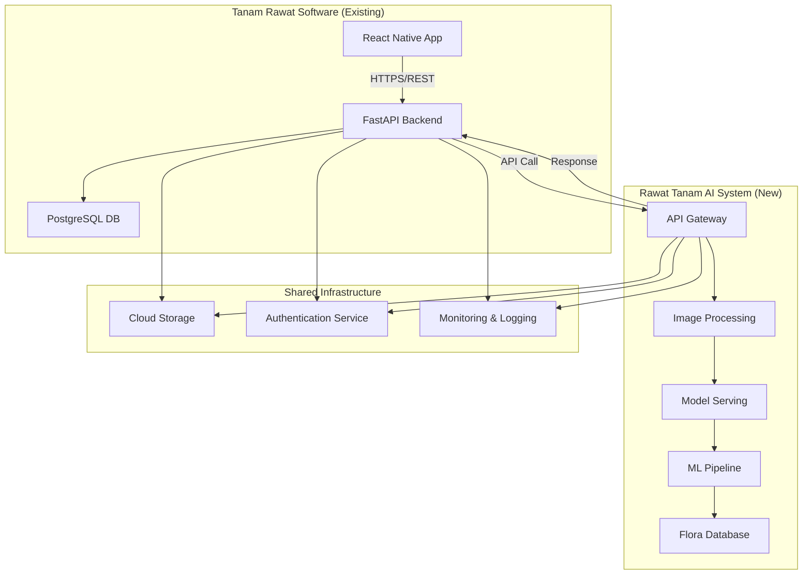

# Arsitektur Integrasi: Tanam Rawat Software ↔ Rawat Tanam AI

**Versi:** 1.0  
**Tanggal:** 19 Desember 2024  
**Status:** Proposal Arsitektur

## 1. Gambaran Umum Integrasi

### 1.1 Konteks Bisnis
**Tanam Rawat Software** adalah aplikasi perawatan tanaman yang sudah dikembangkan dengan fokus pada:
- Identifikasi tanaman menggunakan AI (saat ini simulasi)
- Manajemen koleksi tanaman personal
- Jadwal perawatan otomatis
- Komunitas pehobi tanaman

**Rawat Tanam AI** adalah sistem AI khusus untuk identifikasi flora Indonesia yang akan menyediakan:
- Identifikasi 30,000+ spesies flora Indonesia
- Akurasi ≥85% untuk identifikasi
- Database komprehensif flora Indonesia
- API untuk integrasi eksternal

### 1.2 Tujuan Integrasi
- Menggantikan sistem identifikasi simulasi di Tanam Rawat dengan AI engine yang sesungguhnya
- Memanfaatkan database flora Indonesia yang komprehensif
- Memberikan akurasi identifikasi yang tinggi untuk pengguna Tanam Rawat
- Memungkinkan ekspansi fitur identifikasi yang lebih canggih

## 2. Arsitektur Integrasi

### 2.1 Diagram Arsitektur Tingkat Tinggi



### 2.2 Komponen Integrasi

#### A. Tanam Rawat Backend (Existing - Modified)
**Teknologi:** FastAPI (Python)
**Modifikasi yang Diperlukan:**
- Update endpoint `/identify` untuk memanggil Rawat Tanam AI API
- Implementasi API client untuk komunikasi dengan AI system
- Caching mechanism untuk hasil identifikasi
- Error handling dan fallback mechanism

#### B. Rawat Tanam AI API Gateway
**Teknologi:** Google Cloud API Gateway / AWS API Gateway
**Tanggung Jawab:**
- Authentication dan authorization
- Rate limiting dan quota management
- Request/response transformation
- API versioning
- Monitoring dan analytics

#### C. Rawat Tanam AI Core Services
**Teknologi:** Python/FastAPI + TensorFlow/PyTorch
**Komponen:**
- Image preprocessing service
- ML model serving (TensorFlow Serving/TorchServe)
- Species database service
- Result enrichment service

## 3. API Specification

### 3.1 Authentication
**Method:** API Key + JWT Token
```
Headers:
  Authorization: Bearer <jwt_token>
  X-API-Key: <api_key>
  Content-Type: multipart/form-data
```

### 3.2 Core Endpoints

#### POST /api/v1/identify
**Deskripsi:** Identifikasi tanaman dari gambar

**Request:**
```json
{
  "image": "<base64_encoded_image>",
  "metadata": {
    "location": {
      "latitude": -6.2088,
      "longitude": 106.8456
    },
    "timestamp": "2024-12-19T10:30:00Z",
    "image_quality": "high"
  },
  "options": {
    "max_results": 5,
    "confidence_threshold": 0.7,
    "include_similar": true
  }
}
```

**Response:**
```json
{
  "status": "success",
  "request_id": "req_123456789",
  "results": [
    {
      "species_id": "sp_001",
      "scientific_name": "Monstera deliciosa",
      "common_names": ["Monstera", "Swiss Cheese Plant", "Janda Bolong"],
      "confidence_score": 0.95,
      "family": "Araceae",
      "genus": "Monstera",
      "conservation_status": "Least Concern",
      "native_to_indonesia": false,
      "care_info": {
        "light": "Bright, indirect light",
        "water": "Weekly, when soil is dry",
        "humidity": "60-70%",
        "temperature": "18-27°C"
      },
      "images": [
        "https://storage.googleapis.com/rawat-tanam-ai/species/sp_001/img1.jpg"
      ]
    }
  ],
  "processing_time_ms": 1250,
  "model_version": "v2.1.0"
}
```

#### GET /api/v1/species/{species_id}
**Deskripsi:** Mendapatkan informasi detail spesies

**Response:**
```json
{
  "species_id": "sp_001",
  "scientific_name": "Monstera deliciosa",
  "taxonomy": {
    "kingdom": "Plantae",
    "phylum": "Tracheophyta",
    "class": "Liliopsida",
    "order": "Alismatales",
    "family": "Araceae",
    "genus": "Monstera",
    "species": "deliciosa"
  },
  "description": "Large climbing plant native to Central America...",
  "distribution": {
    "native_range": ["Mexico", "Panama"],
    "introduced_range": ["Indonesia", "Malaysia", "Thailand"]
  },
  "care_guide": {
    "light_requirements": "Bright, indirect light",
    "watering": "Water when top inch of soil is dry",
    "soil": "Well-draining potting mix",
    "fertilizer": "Monthly during growing season",
    "propagation": "Stem cuttings with aerial roots"
  },
  "common_issues": [
    {
      "problem": "Yellow leaves",
      "causes": ["Overwatering", "Poor drainage"],
      "solutions": ["Reduce watering frequency", "Improve soil drainage"]
    }
  ]
}
```

### 3.3 Error Handling
```json
{
  "status": "error",
  "error_code": "INVALID_IMAGE_FORMAT",
  "message": "Image format not supported. Please use JPEG, PNG, or WebP.",
  "details": {
    "supported_formats": ["JPEG", "PNG", "WebP"],
    "max_file_size": "10MB"
  },
  "request_id": "req_123456789"
}
```

## 4. Implementasi Integrasi

### 4.1 Modifikasi Tanam Rawat Backend

#### File: `src/backend/services/ai_client.py`
```python
import httpx
import base64
from typing import Optional, Dict, Any
from fastapi import HTTPException

class RawatTanamAIClient:
    def __init__(self, base_url: str, api_key: str):
        self.base_url = base_url
        self.api_key = api_key
        self.client = httpx.AsyncClient(timeout=30.0)
    
    async def identify_plant(self, image_data: bytes, metadata: Optional[Dict] = None) -> Dict[str, Any]:
        """Identify plant using Rawat Tanam AI API"""
        try:
            # Encode image to base64
            image_b64 = base64.b64encode(image_data).decode('utf-8')
            
            payload = {
                "image": image_b64,
                "metadata": metadata or {},
                "options": {
                    "max_results": 3,
                    "confidence_threshold": 0.7
                }
            }
            
            headers = {
                "X-API-Key": self.api_key,
                "Content-Type": "application/json"
            }
            
            response = await self.client.post(
                f"{self.base_url}/api/v1/identify",
                json=payload,
                headers=headers
            )
            
            if response.status_code == 200:
                return response.json()
            else:
                raise HTTPException(
                    status_code=response.status_code,
                    detail=f"AI service error: {response.text}"
                )
                
        except httpx.TimeoutException:
            raise HTTPException(
                status_code=504,
                detail="AI service timeout"
            )
        except Exception as e:
            raise HTTPException(
                status_code=500,
                detail=f"AI service error: {str(e)}"
            )
```

#### File: `src/backend/main.py` (Modified)
```python
from services.ai_client import RawatTanamAIClient

# Initialize AI client
ai_client = RawatTanamAIClient(
    base_url=os.getenv("RAWAT_TANAM_AI_URL"),
    api_key=os.getenv("RAWAT_TANAM_AI_KEY")
)

@app.post("/identify")
async def identify_plant(file: UploadFile = File(...)):
    """Identify plant using Rawat Tanam AI"""
    try:
        # Validate file
        if not file.content_type.startswith('image/'):
            raise HTTPException(status_code=400, detail="File must be an image")
        
        # Read image data
        image_data = await file.read()
        
        # Call AI service
        result = await ai_client.identify_plant(image_data)
        
        # Transform response for Tanam Rawat format
        if result["status"] == "success" and result["results"]:
            top_result = result["results"][0]
            return {
                "plant_name": top_result["scientific_name"],
                "common_name": top_result["common_names"][0] if top_result["common_names"] else "",
                "confidence": top_result["confidence_score"],
                "care_info": top_result.get("care_info", {}),
                "family": top_result.get("family", ""),
                "ai_service": "rawat_tanam_ai",
                "request_id": result["request_id"]
            }
        else:
            return {
                "plant_name": "Unknown Plant",
                "confidence": 0.0,
                "message": "Could not identify plant"
            }
            
    except Exception as e:
        raise HTTPException(status_code=500, detail=str(e))
```

### 4.2 Environment Configuration

#### File: `.env`
```env
# Existing Tanam Rawat configs
DATABASE_URL=postgresql://...
SECRET_KEY=...

# New Rawat Tanam AI integration
RAWAT_TANAM_AI_URL=https://api.rawat-tanam-ai.com
RAWAT_TANAM_AI_KEY=your_api_key_here
RAWAT_TANAM_AI_TIMEOUT=30
```

## 5. Deployment Strategy

### 5.1 Phased Rollout

#### Phase 1: Development Integration (Week 1-2)
- Setup development environment untuk Rawat Tanam AI
- Implement API client di Tanam Rawat backend
- Testing dengan mock responses
- Unit testing dan integration testing

#### Phase 2: Staging Testing (Week 3)
- Deploy Rawat Tanam AI ke staging environment
- End-to-end testing dengan real AI model
- Performance testing dan load testing
- Security testing

#### Phase 3: Production Rollout (Week 4)
- Gradual rollout dengan feature flag
- Monitor performance dan error rates
- Fallback mechanism ke simulasi jika AI service down
- Full production deployment

### 5.2 Monitoring & Observability

#### Metrics to Track:
- API response times
- Success/error rates
- AI model accuracy
- User satisfaction scores
- Cost per identification

#### Alerting:
- AI service downtime
- High error rates (>5%)
- Slow response times (>5s)
- API quota exceeded

## 6. Security Considerations

### 6.1 Authentication & Authorization
- API key rotation policy (monthly)
- JWT token validation
- Rate limiting per client
- IP whitelisting for production

### 6.2 Data Privacy
- Image data encryption in transit
- No permanent storage of user images
- GDPR compliance for EU users
- Data retention policies

### 6.3 API Security
- Input validation dan sanitization
- File size limits (max 10MB)
- Supported file formats only
- DDoS protection

## 7. Cost Optimization

### 7.1 Caching Strategy
- Cache hasil identifikasi untuk gambar yang sama
- Redis untuk caching dengan TTL 24 jam
- Cache hit rate target: >30%

### 7.2 Request Optimization
- Image compression sebelum upload
- Batch processing untuk multiple images
- Asynchronous processing untuk non-critical requests

## 8. Future Enhancements

### 8.1 Advanced Features
- Multi-modal identification (leaf + flower + fruit)
- Disease detection integration
- Plant health assessment
- Augmented Reality overlay

### 8.2 Analytics Integration
- User behavior tracking
- Popular species analytics
- Geographic distribution insights
- Seasonal identification patterns

## 9. Success Metrics

### 9.1 Technical Metrics
- API uptime: >99.9%
- Response time: <3 seconds
- Identification accuracy: >85%
- Error rate: <2%

### 9.2 Business Metrics
- User engagement increase: >20%
- Feature adoption rate: >60%
- User satisfaction score: >4.5/5
- Reduced support tickets: >30%

## 10. Kesimpulan

Integrasi antara Tanam Rawat Software dan Rawat Tanam AI akan memberikan nilai tambah yang signifikan bagi pengguna dengan menyediakan identifikasi tanaman yang akurat dan komprehensif. Arsitektur yang diusulkan memungkinkan integrasi yang seamless sambil mempertahankan performa dan keamanan yang optimal.

Keberhasilan integrasi ini akan membuka peluang untuk pengembangan fitur-fitur advanced di masa depan dan memperkuat posisi Tanam Rawat sebagai platform terdepan untuk pehobi tanaman di Indonesia.